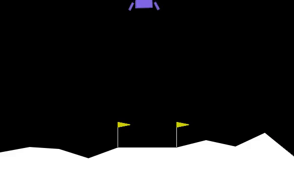
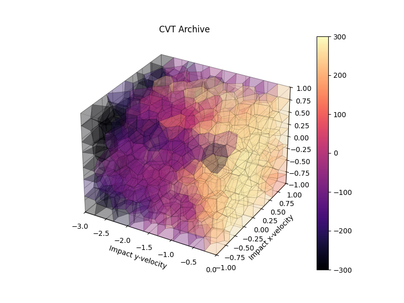

# LunarLander-v3: Quality Diversity with CVTArchive (RIBS)

This project applies **Quality Diversity (QD)** optimization to the [LunarLander-v3](https://www.gymlibrary.dev/environments/box2d/lunar_lander/) environment using the **RIBS** library and a **Centroidal Voronoi Tessellation (CVT) Archive**. The aim is to discover a diverse set of high-performing policies based on multiple behavioral descriptors like impact velocities and positions.

## Demo 1


## Demo 2


## Sample CVT Archive


- **CVT Archive**: Stores elite solutions in centroids defined by descriptors.
- **Emitters**: Use Evolution Strategies to generate new policies.
- **Measures**: Capture behavioral diversity:
  - `impact_y_velocity` (x-axis)
  - `impact_x_speed` (y-axis)
  - `impact_x_position` (z-axis)
- **Objective**: Total reward from landing.

---

## Dependencies

Install required packages:

```bash
pip install gymnasium[box2d] ribs matplotlib dask distributed tqdm
